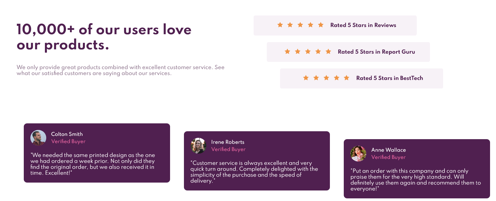

# Frontend Mentor - Social proof section solution

This is a solution to the [Social proof section challenge on Frontend Mentor](https://www.frontendmentor.io/challenges/social-proof-section-6e0qTv_bA). Frontend Mentor challenges help you improve your coding skills by building realistic projects. 

## Table of contents

- [Overview](#overview)
  - [The challenge](#the-challenge)
  - [Screenshot](#screenshot)
  - [Links](#links)
- [My process](#my-process)
  - [Built with](#built-with)
  - [What I learned](#what-i-learned)
  - [Continued development](#continued-development)
- [Author](#author)

## Overview

### The challenge

Users should be able to:

- View the optimal layout for the section depending on their device's screen size

### Screenshot

### Links

- Solution URL: https://github.com/GColville/Social-Proof-Section
- Live Site URL: https://gcolville.github.io/Social-Proof-Section/

## My process

### Built with

- Semantic HTML5 markup
- Vanilla CSS
- Flexbox
- Mobile-first workflow

### Continued development

I need to continue working on my positioning knowledge and skills. I feel that I have used too much CSS for this, and so will continue to revise how I accomplish the styling to ensure that it is as accurate and efficient as possible.

## Author

- Website - [Add your name here](https://www.wannabedev.co.uk)
- Frontend Mentor - [@yourusername](https://www.frontendmentor.io/profile/GColville)
- Twitter - [@yourusername](https://www.twitter.com/wanna_be_dev)
